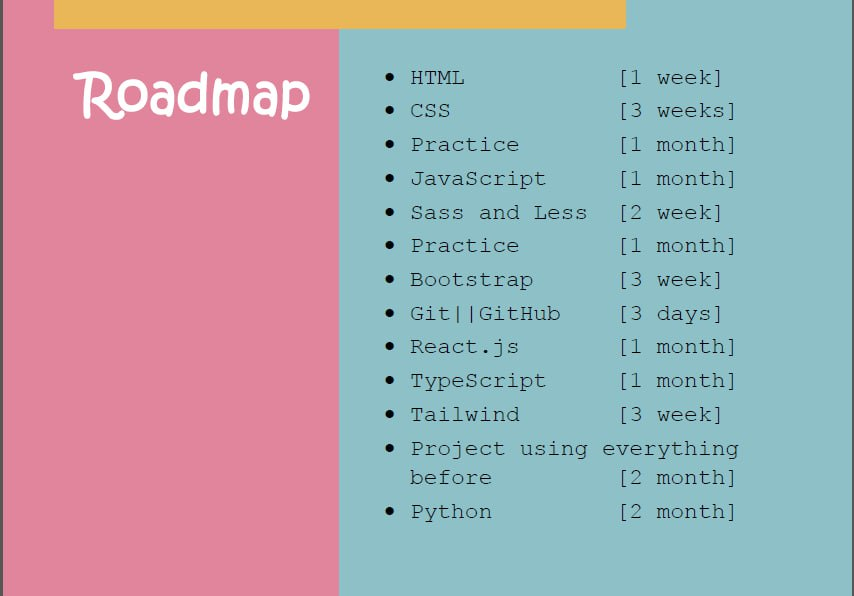

# 🚀 My Frontend Learning Journey

Welcome to my personal roadmap and learning archive for becoming a professional Frontend Developer.

This repository follows a clear path that I designed and committed to, covering essential technologies like **HTML, CSS, JavaScript**, frameworks like **React, Tailwind**, and even **Git, TypeScript, and Python**.

---

## 🗺️ Learning Roadmap (Visual)

Here's the learning map I'm following:

---

## ✅ Progress Overview

| Topic               | Duration | Status |
|-------              |----------|--------|
| HTML                | 1 week   | ✅     |
| CSS                 | 3 weeks  | ✅     |
| Practice (HTML/CSS) | 1 month  | ✅     |
| JavaScript          | 1 month  | ⏳      |
| Sass / Less         | 2 weeks  | 🔜     |
| Practice            | 1 month  | 🔜     |
| Bootstrap           | 3 weeks  | 🔜     |
| Git/GitHub          | 3 days   | 🔜     |
| React.js            | 1 month  | 🔜     |
| TypeScript          | 1 month  | 🔜     |
| Tailwind CSS        | 3 weeks  | 🔜     |
| Final Project       | 2 months | 🔜     |
| Python              | 2 months | 🔜     |
---

## 📚 What’s Inside

- ✅ Topic-based folders with notes, projects, and challenges
- ✅ Real practice projects at each level
- ✅ GitHub version control and commit history
- ✅ Full-stack-ready structure (with Python basics too)

---

## 🧠 My Goal

> Learn by doing, document every step, and build a real portfolio out of my learning process.

---

## 📎 Resources

You’ll find curated resources inside [`resources.md`](./resources.md).

---

**Feel free to follow, fork, or get inspired by the structure!**
